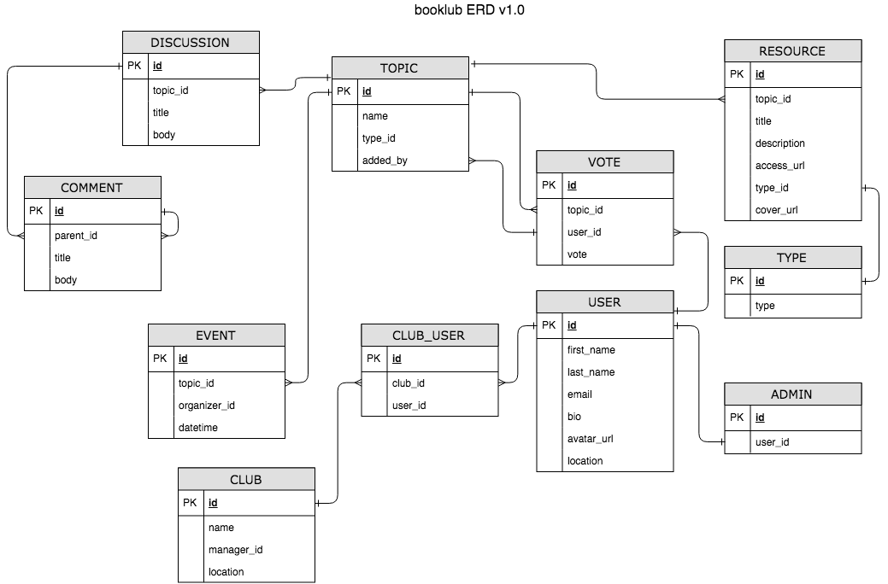

# StudyClub 

StudyClub helps manage topics and discussions for book clubs.

## Data Model

## Setup
- Get project: `git clone <url>`
- `cd` into project directory and install dependencies with `bundle`
- Create development database: `rails db:create`
- Create schema: `rails db:migrate`

# Development  
- Run dev server: `rails s`

## Contributing
- coming soon
